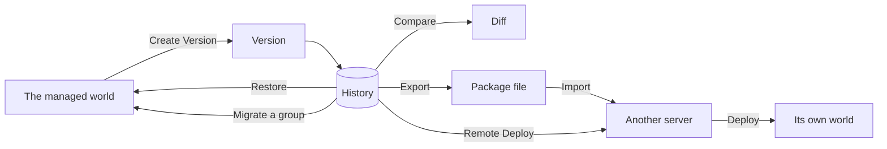

Blueprints captures the managed state of a Garry's Mod server, keeps a history of it, tells
you what changed between any two points, and moves a build to another map or another
server.

It is an admin tool. Players never see it, and nothing about it changes how your server
plays.

## The model

<Steps>
  <Step title="Capture">
    You ask Blueprints for a **Version**. It walks every object type it has an adapter
    for, records each object as plain data, and writes an immutable, timestamped document
    to your own server.
  </Step>
  <Step title="Compare">
    Any two Versions can be compared object by object: added, changed, removed. Object
    identity is stable, so a prop you moved is reported as moved rather than as one
    deletion and one creation.
  </Step>
  <Step title="Organise">
    A **Group** is a named set of objects with its own anchor. You move, rotate and place
    the group by that anchor rather than dragging its members one at a time.
  </Step>
  <Step title="Act">
    **Migration** rebuilds a group from a past Version somewhere else. **Restore** returns
    the managed world toward an earlier Version. **Deploy** hands a Version to another
    server. Every one of them shows its full plan before the first change.
  </Step>
</Steps>

## Authority: what it will and will not touch

This is the single most important thing to understand about the product.

<Warning>
Blueprints manages the object types it has a compatible **adapter** for, and nothing else.
It does not capture, modify or restore anything outside that set, and it does not modify
other addons' code or configuration files.
</Warning>

In version 1.0 the shipped adapters cover:

| Domain | Adapter | Notes |
| --- | --- | --- |
| Props | `vetra.props` | Props standing in the world |
| NPCs | `vetra.npcs` | Anything the engine reports as an NPC |
| DarkRP job spawns | `darkrp.job_spawns` | SQLite-backed DarkRP only |
| PermaProps props | `permaprops.props` | MalboroDEV PermaProps, item `220336312` |

An enabled adapter does write the addon-owned data it is responsible for, and only that.
The DarkRP adapter updates DarkRP job-spawn records; the PermaProps adapter updates
PermaProps rows. That is what managing those domains means, and it is not the same thing
as editing somebody's addon.

See [Supported objects and integrations](/blueprints/supported-objects) for the full
capability matrix, and the [Adapter SDK](/sdk/overview) if you want Blueprints to manage
something it does not yet know about.

## Vocabulary

<ResponseField name="Version" type="the unit of history">
  An immutable, timestamped record of the managed world at one moment, on one map. The
  product calls it a Version. The stored document and the SDK both call it a *snapshot*;
  they are the same thing.
</ResponseField>

<ResponseField name="Object" type="one managed thing">
  One prop, NPC, job spawn or saved PermaProp, recorded as plain data with a stable
  identity, a type, an optional position and orientation, and a set of properties.
</ResponseField>

<ResponseField name="Group" type="a named set">
  Up to 512 objects treated as a unit, with an anchor that defines where the group *is*.
  Groups are what migration and cross-server deployment operate on.
</ResponseField>

<ResponseField name="Adapter" type="one domain's translator">
  The code that teaches Blueprints how to read and write one object type. Four ship with
  the product; anyone can write more.
</ResponseField>

<ResponseField name="Package" type="a Version in a file">
  A portable `.vetra.json` file holding a Version and its provenance. It is how a build
  crosses a server boundary, with or without Vetra's service in the middle.
</ResponseField>

## What it is not

- **Not a backup product.** It records the object types it manages, not your gamemode
  configuration, your database, your Workshop collection or your server files.
- **Not a merge tool.** There is no branching and no merge. A Version is a full record,
  not a patch on the one before it.
- **Not a live sync.** Nothing happens on a schedule. Every capture, restore and
  deployment is something a person asked for.
- **Not player-facing.** The interface is admin-gated and nothing about it is installed by
  hand on a client.

## Next

<CardGroup cols={2}>
  <Card title="Installation" icon="download" href="/blueprints/installation">
    Two folders and a restart.
  </Card>
  <Card title="Quick start" icon="play" href="/blueprints/quickstart">
    Your first Version, diff and restore.
  </Card>
</CardGroup>
