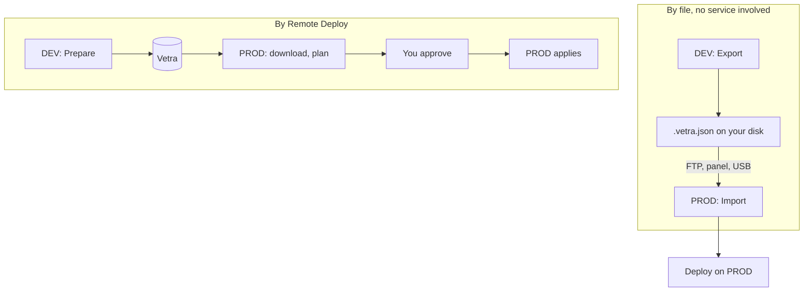

Remote Deploy does what [export and import](/blueprints/packages) does, without you moving
a file: your development server uploads the package to Vetra, the production server
collects it, plans against its own world, and applies it once you approve.

<Note>
Remote Deploy is **optional**. Every Version can always be exported to a file, transferred
by any means you like, and imported on the other server without the Vetra service being
involved. See [Export and import](/blueprints/packages).
</Note>

You drive it from inside Garry's Mod, on the **Remote Deploy** screen. There is no web
dashboard to sign into, and no customer account to create.

## Two routes to the same outcome

Both end at the same place: a deployment on the production server, planned against that
server's own world and applied by it.

## What you need

- Both servers activated on the same licence.
- Outbound HTTPS from both servers, while you are using it. A cached licence is enough to
  keep local Blueprints working offline, but Remote Deploy is a live operation and needs
  the connection at the time.
- The same map on both servers. Remote deployment is same-map.

## The flow

<Steps>
  <Step title="Prepare, on the development server">
    Pick a Version and a target. Blueprints exports the Version as a package and uploads it
    to Vetra.

    Transfer progress is shown in real bytes. Where Blueprints has no real number, it shows
    the **phase** instead. There is no invented percentage anywhere in this screen, because
    an invented number during a destructive operation is a lie.
  </Step>

  <Step title="The target picks it up">
    The production server polls Vetra on its own schedule, downloads the package, checks it
    against its digest, and plans against a fresh capture of its own world.
  </Step>

  <Step title="Approve">
    The plan comes back to you: what will be created, moved, conformed and destroyed on the
    target server, plus anything needing an acknowledgement.

    The wording here names **the target server** in every sentence, deliberately. "12
    objects will be overwritten" reads very differently when the objects are on a machine
    you are not sitting at.

    Nothing on the target has been modified at this point.
  </Step>

  <Step title="Apply">
    The target server takes a scoped recovery capture, applies the plan, and verifies the
    result against the Version.
  </Step>
</Steps>

## Where authority actually sits

<Warning>
The screen you are reading the plan on has **no authority**. It displays a plan the *target*
server computed and Vetra relayed, and sends back the fingerprint of what it displayed.
</Warning>

Your own server re-fetches the current plan from Vetra before relaying your approval, and
the target re-plans from a fresh capture before it writes anything. Approving one plan and
having a different one applied is not a thing that can happen.

The production server always decides what happens to its own world.

## States

| State | What it means |
| --- | --- |
| **Waiting for target** | Vetra is holding this. It starts when the target next checks in |
| **Target picked it up** | The target has taken it on and is about to fetch the package |
| **Downloading** | The target is fetching the package and checking its digest |
| **Planning** | The target is working out what would change. Nothing modified |
| **Waiting for your approval** | The plan is ready. Read it. Nothing modified yet |
| **Approved** | The target will apply it at its next check-in |
| **Applying** | The target is changing its world. It took a recovery capture first, and this cannot be cancelled |
| **Plan changed; review again** | The target's world changed after you approved, so nothing was applied. A new plan is coming |
| **Deployed** | Applied and verified against the Version |
| **Failed** | Did not complete. Nothing on the target is half-finished |
| **Cancelled** | You stopped it before anything was applied |
| **Recovery required** | The target was interrupted mid-apply. An administrator has to run its recovery there. Nothing is re-applied automatically |
| **Expired** | Nobody acted before the window closed. Nothing was applied |

## When something fails

Failures come back in a closed vocabulary with a sentence you can act on. You will never
see a stack trace, a database error or an internal code.

| Failure | What to do |
| --- | --- |
| The package could not be moved | Network or storage. Says nothing about your licence. Try again |
| The package was not readable | Export the Version again |
| The target could not produce a plan it would run | Open **Deploy** on that server to see what is blocking it |
| The target is on a different map | Remote deployment is same-map |
| The target could not finish applying | It ran its own recovery. Check **Deploy** on that server |
| The target could not verify the result | Check **Deploy** on that server |
| The target restarted while working on this | Nothing was applied. Prepare it again |
| The target already matches this Version | Nothing to deploy. This is not a problem |
| Vetra will not authorize this | Check both servers are enabled and licensed for Blueprints |

## What Vetra stores

When you use Remote Deploy, the package you selected is uploaded to and stored on the Vetra
service, together with a record of that deployment. Nothing else about your server is sent,
and nothing is uploaded unless you start a deployment.

Packages your deployment history references are **retained**, and not deleted on a
schedule. Redeploying an older Version and rolling back are the same operation, and both
need the original bytes; a support question about what you deployed is only answerable
while the package still exists.

Uploads that were started and never completed are cleaned up. If you want a stored package
removed, ask.

Full detail in [Where your work is stored](/support/data).
