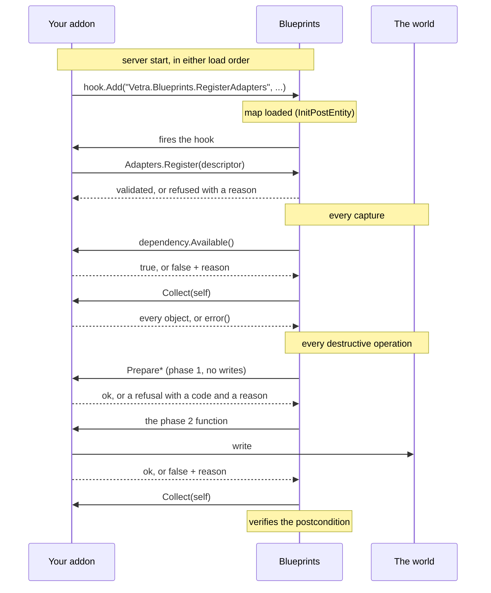

Blueprints does not know what a "job spawn" or a "zone" or a "shop" is. **An adapter is the
piece that teaches it one domain**, and this is the documentation for writing one.

An adapter lives in your own addon. You do not modify Blueprints, you do not read its
internals, and you do not need to understand snapshots, diffs, migrations or restore to
write one.

<Card title="Quickstart" icon="rocket" href="/sdk/quickstart" horizontal>
  A registered, capturable adapter in one file. Read this first.
</Card>

## The question this answers

> I have an addon with objects Blueprints does not currently understand. How do I make
> Blueprints manage them safely?

You describe your domain as plain data, declare which operations you can honour for **every**
object you produce, and implement those. Blueprints composes its workflows out of what you
declared.

## What an adapter is responsible for

<Steps>
  <Step title="Registering">
    From one hook, once, after the map loads. Load order between your addon and Blueprints
    does not matter. See [Registry](/sdk/registry).
  </Step>
  <Step title="Describing your domain">
    `Collect` returns every object in your domain, on this map, as plain data. All of them or
    none. See [Records](/sdk/records).
  </Step>
  <Step title="Giving each object a stable identity">
    The single most consequential decision you will make. See [Identity](/sdk/identity).
  </Step>
  <Step title="Declaring capabilities truthfully">
    Each capability is a promise about **every** record you emit, not about most of them. See
    [Capabilities](/sdk/capabilities).
  </Step>
  <Step title="Implementing the world operations you declared">
    Move, rebuild, conform, destroy. Each has a phase that answers and a phase that writes.
  </Step>
</Steps>

## What Blueprints is responsible for

- Planning. Migration, restore and deployment are *workflows* composed from your primitives.
  You never declare "restore".
- Persistence, diffing, grouping, previewing, verification and rollback.
- Refusing to act where your declarations do not support it, and saying so in a sentence.
- Never dropping your historical records, even on a server where your adapter is not
  installed.

## The adapter lifecycle



## The five capabilities

```text
snapshot      capture your domain                       REQUIRED
transform     move and reorient an existing object
materialize   rebuild one of your records, and undo that
properties    conform an existing object to a record you captured
remove        destroy an existing object                requires materialize
```

There is no `create`, `update`, `delete`, `migrate` or `restore`. Those words describe
operations that are either unbounded or composed, and the SDK deliberately does not offer
them.

## Realm

<Warning>
**Adapters are server-side.** Put your registration in `lua/autorun/server/`, or in a file
whose name begins `sv_`.
</Warning>

Entities, the world and your addon's data live on the server, and a captured record is
server state. Nothing in the adapter contract runs on a client, and no part of your adapter's
logic is ever sent to one, including previews, which cross the wire as declarative data
rather than as code.

## Official adapters get no privileges

Adapters shipped by Vetra are marked `official` in the product's **Adapters** screen. That
records who maintains it and nothing else: official adapters register through the same hook,
use the same functions, and have no privilege you do not have. The built-in props adapter
registers through exactly the hook your addon uses, on purpose, so the built-in contract
cannot quietly diverge from the public one.

## Where to go next

<CardGroup cols={2}>
  <Card title="Quickstart" icon="rocket" href="/sdk/quickstart">
    Registration through capture, minimal.
  </Card>
  <Card title="Adapter anatomy" icon="list-tree" href="/sdk/anatomy">
    Every field and function, required, optional or capability-dependent.
  </Card>
  <Card title="Identity" icon="fingerprint" href="/sdk/identity">
    Read this before you choose how to generate ids.
  </Card>
  <Card title="Compatibility checklist" icon="clipboard-check" href="/sdk/checklist">
    Read this before you ship.
  </Card>
</CardGroup>
